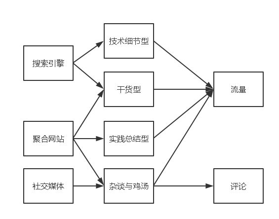
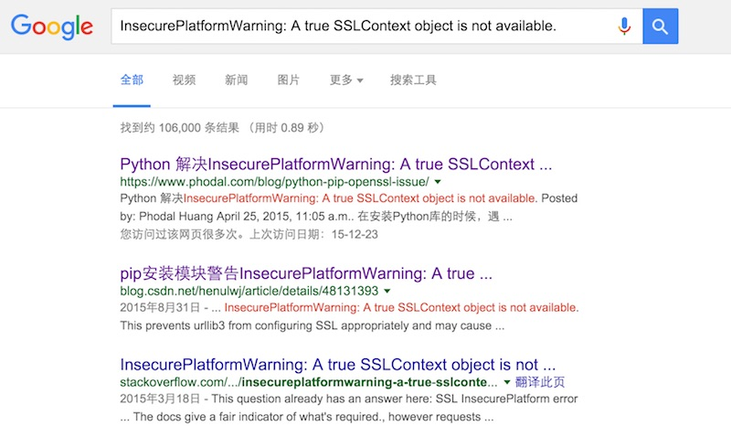

分析篇：人们需要什么？
===

对于以技术为核心的技术博客来说，人们是冲着他们需要的内容去的，绝大多数情况下都不是在闲逛。如果你的网站里没有他想要的东西的话，他便会离开，人们是出于目的去搜索，基于动机，而不是无聊的在闲逛。无聊的话，他们更多的会去刷刷朋友圈的。

阅读的类型
---

###完成工作

对于大多数的用户来说，他们想要的只是获取他们想要的内容，而我们做的也就是把他们所需要的信息给予他们。这里要说的不是如何去编写内容，说的便是如何去设计一个好的排版，而这里说的排版也不是很复杂的。

基本的用户心理便是:

> 用户不想在你的网站花费太多的时间，他们需要有足够的时间去做别的事情

这点可以从技术人员的心理去思考，我们只想解决我们的问题，而使用搜索引擎的目的就是去找到我们需要的内容。

###提升自己

###扩展知识

###鸡汤

如何获取，来源
---

首先，我将技术博客分为下面几种类型:

1. 技术细节型。频率: 每天几次，15~30分钟可以写完。
2. 干货型。频率: 每月几次，1~2小时可以搞定。
3. 实践总结型。频率: 每周1～2次，2+小时以上的时间。
4. 杂谈与鸡汤型。频率: 每季度几次，少则几小时，动则上月。

接着，奉献上一章我的博客的用户来源图，分析完大概如下：

**前三者可以带来很多的流量，后者可以带来大量的评论啦。**

**前三者可以让你在Google上有一个好位置~~，后者可以让你在用户心中有个好位置。**

**通过社交媒体可以让第四种类型的文章，有大量的评论和转载。**

**干货型和实践总结型的文章通过聚合网站来传播的效果最好。**

在Google中有个好位置意味着——第一的位置会有50%以上的用户访问，这一点很重要哦~~。再放出神图：

首先作为一个专业的程序员，我们会用某个关键词去搜索，如“InsecurePlatformWarning: A true SSLContext object is not available.” :如果这时你的标题就是《[Python 解决 InsecurePlatformWarning: A true SSLContext object is not available](https://www.phodal.com/blog/python-pip-openssl-issue/)》，那么你就找到了你的用户了。

**这是我之前用了5分钟不到的文章写的一篇文章，它在半年的时间里带来了6,599个访问量**。它在Google的搜索结果中排第一：

虽然很不情愿地被排名第二的文章抄袭了——但是我还是第一，这该死的**伪原创**。

而用户不会只访问你的一个页面的:

**一般来说，前三种类型的用户获取到他们想要的信息就走了，不会留下评论**。至于第四种类型，没有大V的光环，偶尔文章被转企业V转转也能多个几十个粉丝。所以我没有第四种类型的文章太多的经验哈。

###搜索引擎

###聚合网站

###讨论

###朋友圈
