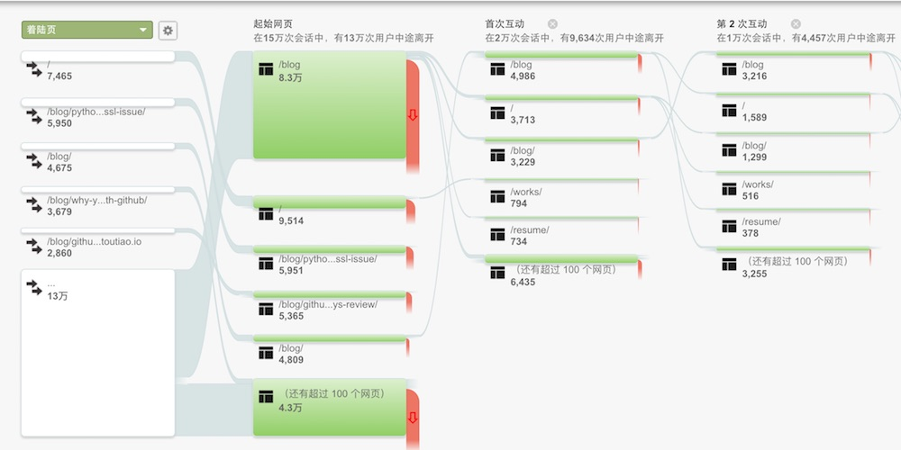
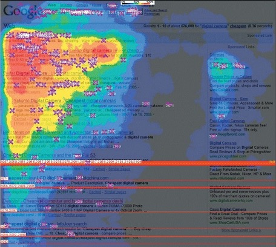
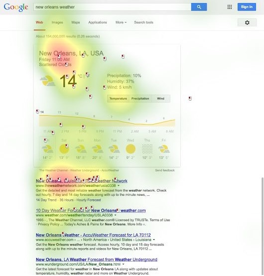
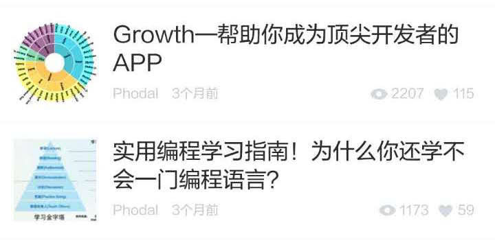
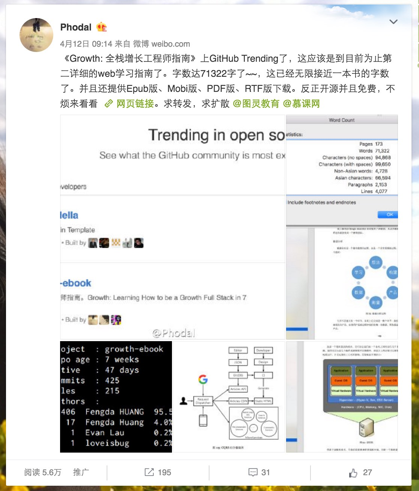
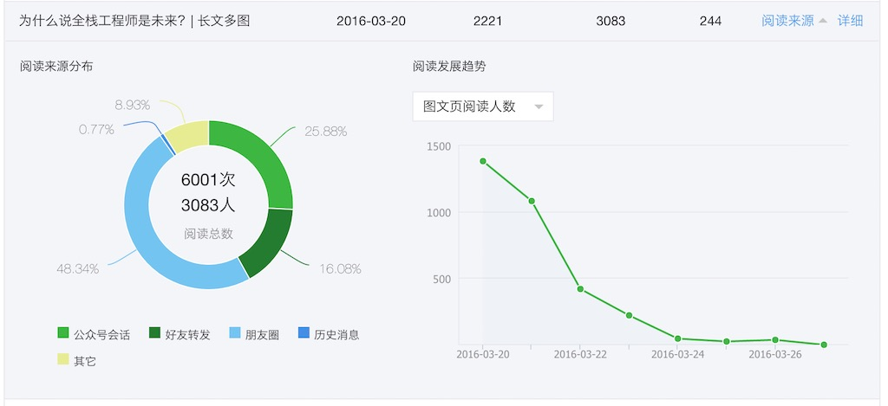
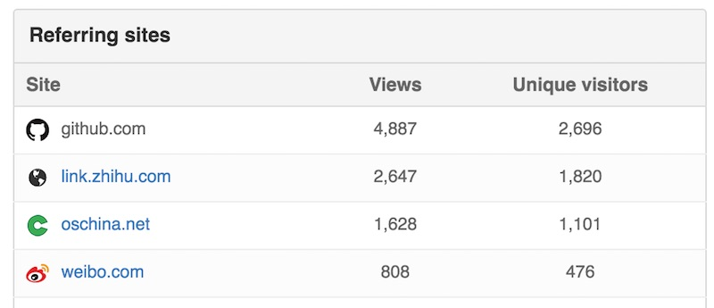

分析篇：什么样的文章受欢迎？
===

对于以技术为核心的技术博客来说，人们是冲着他们需要的内容去的，绝大多数情况下都不是在闲逛。如果你的网站里没有他想要的东西的话，他便会离开，人们是出于目的去搜索，基于动机，而不是无聊的在闲逛。无聊的话，他们更多的会去刷刷朋友圈的，看看鸡汤。

文章的类型
---

依据我的经验，我将技术博客分为下面几种类型:

 文章类型        | 频率           |  时间
 ------------------|---------------|-------------
 技术细节型    | 几次/天     | 15~30分钟
干货型             | 几次/月     | 1~2小时
实践总结型     |  几次/ 周   | 2+小时
杂谈与鸡汤型 | 几次/季度 |1 + 小时 ~ 几个月

并且他们的流量来源大概来源于下图所示：

分析如下：

 - **前三者可以带来很多的流量，后者可以带来大量的评论啦。**
 - **前三者可以让你在Google上有一个好位置，后者可以让你在用户心中有个好位置。**
 - **社交媒体可以让第四种类型的文章，有大量的评论和转载。**
 - **干货型和实践总结型的文章通过聚合网站来传播的效果最好。**
 - **前三种类型的用户获取到他们想要的信息就走了，不会留下评论**。
 - **第四种类型，没有大V的光环，偶尔文章被转企业V转转也能多个几十个粉丝。所以我没有第四种类型的文章太多的经验哈。**

不过，下面我们要依据不同的流量来源来分析文章的用户群体。

###搜索引擎：完成工作

使用搜索引擎来找内容的用户一般都是为了``完成工作``，这一类的流量主要是以技术细节型的文章为主。先让我们简单地了解一下，什么是技术细节型的文章——就是看一些标题啦：

 - [Django ElasticSearch Ionic 打造GIS 移动应用](https://www.phodal.com/blog/django-elasticsearch-ionic-build-gis-application/)
 - [Django Haystack ElasticSearch 环境准备](https://www.phodal.com/blog/django-elasticsearch-haystack-prepare-enviorment/)
 - [Ionic ElasticSearch 搜索服务](https://www.phodal.com/blog/ionic-searchview-django-elasticsearch-ionic-build-gis-application/)

这一些文章展现了特别多的技术细节。对于不懂这个领域的人来说，他们完成没有兴趣。因此就算你把这一类的文章推送到各个平台上，也不会有效果的。所以写好内容，然后取个好标题，然后将这件事交给搜索引擎就可以了。他们想要的只是获取他们想要的内容，而我们所要做的就是给他们想要的内容。因为：

> 用户不想在你的网站花费太多的时间，他们需要有足够的时间去做别的事情

我们只想解决我们当前的问题，完成后我们就可以去刷朋友圈了。

####用户行为分析

下图是我博客的流量来源分析：

我们可以看到在第二栏“起始页”里，绝大部分的用户（13万/15万）都离开了——即用户找到了他们想要的内容，随后就离开了，这对于其他类型的文章也是一样的。不过，值得注意的是大概会有2万的用户会继续访问其他页面。

主要的用户来源都来自Google，这时就依赖于我们在Google中有一个好的排名。上神图：

依据Mediative在2014年的研究([The Evolution of Google’s Search Results Pages & Effects on User Behaviour](http://www.mediative.com/whitepaper-the-evolution-of-googles-search-results-pages-effects-on-user-behaviour/))表明，新的眼动研究如下图所示：

这只是在说明Google的语义化搜索，已经初显成效。值得注意的是：2005年时，前4位的链接点击比例是47.8%，而在2014年这次研究的结果是62.6%。

作为一个专业的程序员，我们会用问题的关键词去搜索，如``InsecurePlatformWarning: A true SSLContext object is not available.`` 。 如果这时你的标题就是《[Python 解决 InsecurePlatformWarning: A true SSLContext object is not available](https://www.phodal.com/blog/python-pip-openssl-issue/)》，那么你就找到了你的用户了。

 **这是我之前用了5分钟不到的时间写的一篇文章，它在半年的时间里带来了6,599个访问量**。它在Google的搜索结果中排第一：

(PS: 虽然很不情愿地被排名第二的文章抄袭了——但是我还是第一，这该死的**伪原创**。)

对于大部分用户来说，一看到这个标题就深深觉得这会解决自己的问题，并且它还是中文的。同时，随着用户点击量的升高这篇文章的排名就会越来越高——这就是Google。

用户试了一下上面的解决问题的思路，发现可以工作，于是就走了。当用户发现按上面的步骤来不行，大部分用户就直接离开了。除非这是唯一的解决方案，那么用户可能会抱一点点希望的留个言。

###聚合网站

对于现今的大部分技术类聚合网站来说，他们的特点都是差不多的——即由用户来提交技术文章的链接，再由用户来对文章进行“顶”和“踩”来决定其在首页的位置。这一类比较流行的有：

 - CSDN的极客头条 (http://geek.csdn.net)
 - 开发者头条 (http://toutiao.io/)
 - 稀土掘金 (http://gold.xitu.io/)

他们的特点都和上面是一样的，唯一有所区别的是``开发者头条``是由编辑来选出可以上头条的，随后也会进入用户顶和踩的通道。

这里是我们能统计到流量的网站的数据：

上图是文章发布在CSDN极客头条上的，可以看到阅读数有5k+。

而在稀土掘金上也有1k+的阅读量，而如果是一些更好的技术文章，那么它就会有更高的阅读量。在这些网站上比较受欢迎的文章类型就是：

 - 干货型            
 - 实践总结型    
 - 杂谈与鸡汤型

除了好的内容之外，他也应该是普通用户能读懂的读物，如：

  - [程序员如何提高影响力 2.0](https://www.phodal.com/blog/improve-impact-2/)
  - [Developer进阶书单](https://github.com/phodal/booktree)
  - [我的编程生涯里启发我的15本书](https://www.phodal.com/blog/most-important-15-books-of-phodal-programmer-life/) 

对于这部分的内容来说，我们只需要关注一点：**人们只关注和自己相关的，并且也是可以达到的**。

除此，还要有一个好的标题：

 - [最流行的编程语言JavaScript能做什么？](http://zhuanlan.zhihu.com/p/20731338) 这只是一篇介绍JavaScript在不同领域的应用。
 - [听我说说我的博客: 月访问量过万的个人IT博客的技术史](https://www.phodal.com/blog/phodal-blog-techlogoy-development/) 这只用来介绍我博客的技术发展史。

这些文章和总结只要标题好、内容实在，都很容易在聚合网站上有一个好的排名。

###社交与新媒体

这一类主要于**传播性**为主，主要适合那些“杂谈与鸡汤型”和不需要代码的“干货型”。因为我不是一个大V啦，我只能介绍一些有限的经验。主要以下面的几个为主:
 
  - 微博
  - 微信公众号
  - 知乎
  - 论坛
  - 媒体平台，如今日头条的头条号、企鹅媒体平台等等

需要注意的一点是，微信公众号是封闭的，即如果我们的粉丝量少，那么我们要推广我们的文章难度非常大。这一点同理于微博，但是我们可以在微博上@大V，如果内容好，那么大V自然也会帮你转。而知乎、论坛则是开放型的，而这主要是取决于在这个平台上用户的质量比较高。媒体平台则是另外一种形式，主要是由于笔者尝试了几次，发现在这些平台上也是可行的，除了读者的质量比较不高。

对比如下：

 类型                 |  开放度      | 传播难度     |  粉丝质量     |  保护原创              | 上手难度  | 受众                    | 持续性
-------------------|----------------|-----------------|-----------------|------------------------|--------------|----------------------| ----
微博                 |  中等            |  一般           | 中等              | 特别差                   | 容易          | 依赖于粉丝数    |  一天~几天
微信公众号     | 封闭            | 难                | 高                  | 高                            |  难             | 依赖于粉丝数 | 几天
知乎                 | 高                | 容易             | 高                   | 中等                      |  容易         | 关注话题的人 | 几天~几个月
论坛                | 中等            | 容易              | 中等               | 一般                      | 容易          | 论坛中的用户 | 几天
媒体平台        | 高                | 容易                | 一般              | 高                         | 难             | 几乎所有相关的用户 | 一天~几天

下面就让我们展开上面的内容吧！

####微博

技术文章要在微博上传播开来的难度还是挺大的，除非你是大V。但是如果是一些好的内容也可以传播开来，主要看大V的扩散了——大V就是你的文章的引爆点。如下图是我之前写的 《[全栈增长工程师指南](https://github.com/phodal/growth-ebook)》，有幸得图灵教育和慕课网的扩散，因此有了195个转发。

然并卵，由于没有分析工具，就没有办法帮分析了。值得注意的是，文章在微博上的传播时间比较短。换句话说，在明天没有人转发你的微博了。它唯一的主要作用是，帮你提高粉丝数。

####微信公众号

微信公众号就是一个门槛更高的活动了，坑比较深。如果好友不多、粉丝不高、自身知识度不高，传播起来难度就更大了。由于我的粉丝数量还不是非常多，我只能从中挑选中阅读量最高的一篇文章。这篇《[为什么说全栈工程师是未来？](http://mp.weixin.qq.com/s?__biz=MjM5Mjg4NDMwMA==&mid=405019922&idx=1&sn=354643ee38b0ca423cd0f3025fb98338#rd)》一共有2897个阅读，244个转发。

所以，你也猜到了主要是靠朋友圈转发。而这有一个明显的限制是，假设1000个粉丝里只有20个转发，那么这篇文章的每天阅读人数就会是就会呈现递减趋势。通常这也是大部分文章的阅读量模型，除非中间有大V转发。

####知乎

知乎也是我最近尝试去玩的平台，总得来说上手是最容易的——只要你的内容好，那么完全没有难度。如下图是《[全栈增长工程师指南](https://github.com/phodal/growth-ebook)》的流量来源，会发现知乎占了很大的一部分。这种软植入的广告，在大家看来还是可以接受的。

然，如果我们尝试在上面推广微信公众号的话，可能会遇到一些挫折。不过可以放上微信上的文章的链接。

####媒体平台

####简书

简书也是一个很不错的写作平台，只是如果我们的文章上不了首页推荐的话，那么我们也不难获得很高的阅读。当你上了首页的推荐后，就会有下面的阅读量和喜欢。受限于技术文章的阅读群体比较小，也不会特别广。

不过，如果你写的是什么值得推荐的APP那就还好，一般人都看得懂。并且简书上是打不了广告的，我们只依靠于在文中放点链接，哈哈~~。

这也恰恰是它为什么是一个非常好的写作平台的原因。

###小结： 大连接

最后，让我们一张图结束这一篇的内容吧！你能想到什么？？

